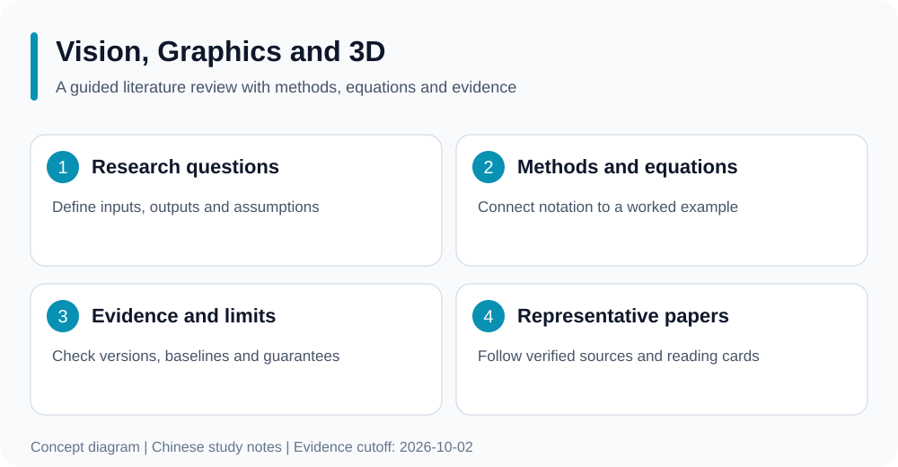

# 视觉、图形与三维场景综述

### 面向正在学习科研方法的读者

**从研究问题出发，理解方法与公式，对比代表性及近期研究，并沿论文卡片核对结论依据。**

[English](README.md) | 中文

[领域综述](docs/review.md) · [代表与前沿研究](docs/representative-research.md) · [阅读指南](docs/reading-guide.md) · [论文目录](docs/catalog.md)

*综述学习流程概念示意。*

## 从哪里开始

正文、阅读指南和论文卡片使用**中文**，英文首页提供项目范围与导航。无需安装软件，可直接阅读；公式适合在支持数学排版的 Markdown 平台上查看。

1. 按[阅读指南](docs/reading-guide.md)补齐前置知识，完成小型手算练习。
2. 阅读[领域综述](docs/review.md)，建立问题、方法、公式和局限之间的联系。
3. 对比[代表与前沿研究](docs/representative-research.md)，通过[论文目录](docs/catalog.md)进入单篇论文卡片，核对公开原始来源。

## 内容与证据范围

| 材料 | 用途 |
| --- | --- |
| [领域综述](docs/review.md) | 问题地图、方法、公式及证据边界 |
| [代表与前沿研究](docs/representative-research.md) | 基础与近期方向及来源 |
| [阅读指南](docs/reading-guide.md) | 通用学习阶段与核验练习 |
| [论文目录](docs/catalog.md) | 主领域 48 篇、交叉领域 61 篇、补充阅读引用 0 篇 |
| [文献元数据](bibliography.json) | 公开题名、索引年份、领域分类、阅读依据与来源链接 |

本仓库论文卡片的证据级别为：全文相关部分已核对 12 篇，摘要或公开简介已核对 66 篇，仅题名 31 篇。全文级别表示核对了相关部分，不表示全篇精读；摘要和题名级别不支持未经核验的方法细节或实验结论。

核验截至 **2026-10-02**。这是一份持续完善的文献选读综述，覆盖范围不等同于穷尽式系统综述。索引年份、预印本版本与正式发表日期可能不同，具体以论文卡及原始来源的说明为准。不同领域仓库有交叉收录，跨仓库数量不能直接相加为独立论文总数。

## 来源与勘误

内容为教学性综述和方法解释，链接至原论文与官方发表页面；论文题名与研究贡献归其作者。通过公开来源链接查阅原文。引用数值或理论结论时，应同时核对所引版本、实验条件和定理假设。勘误请提供题名、版本及支持来源。
